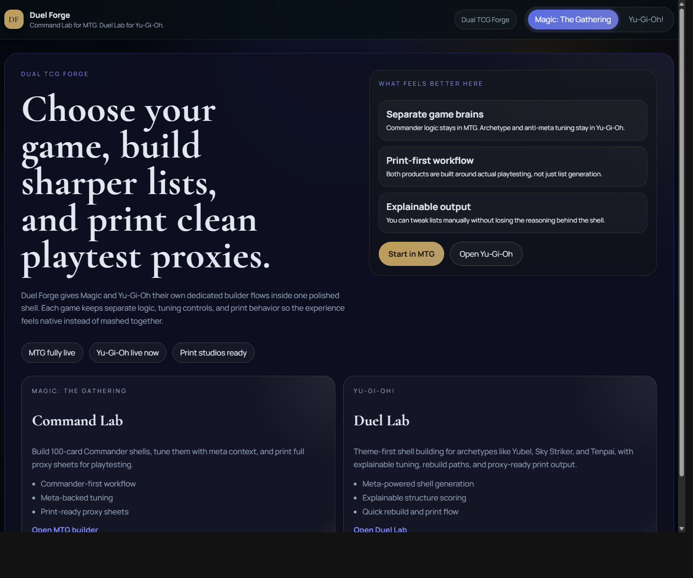
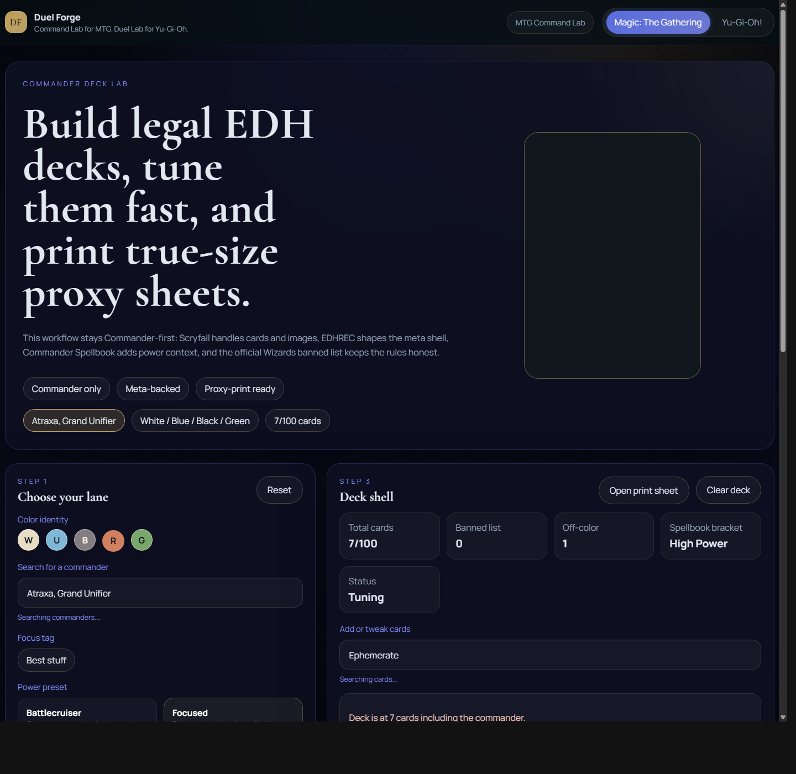
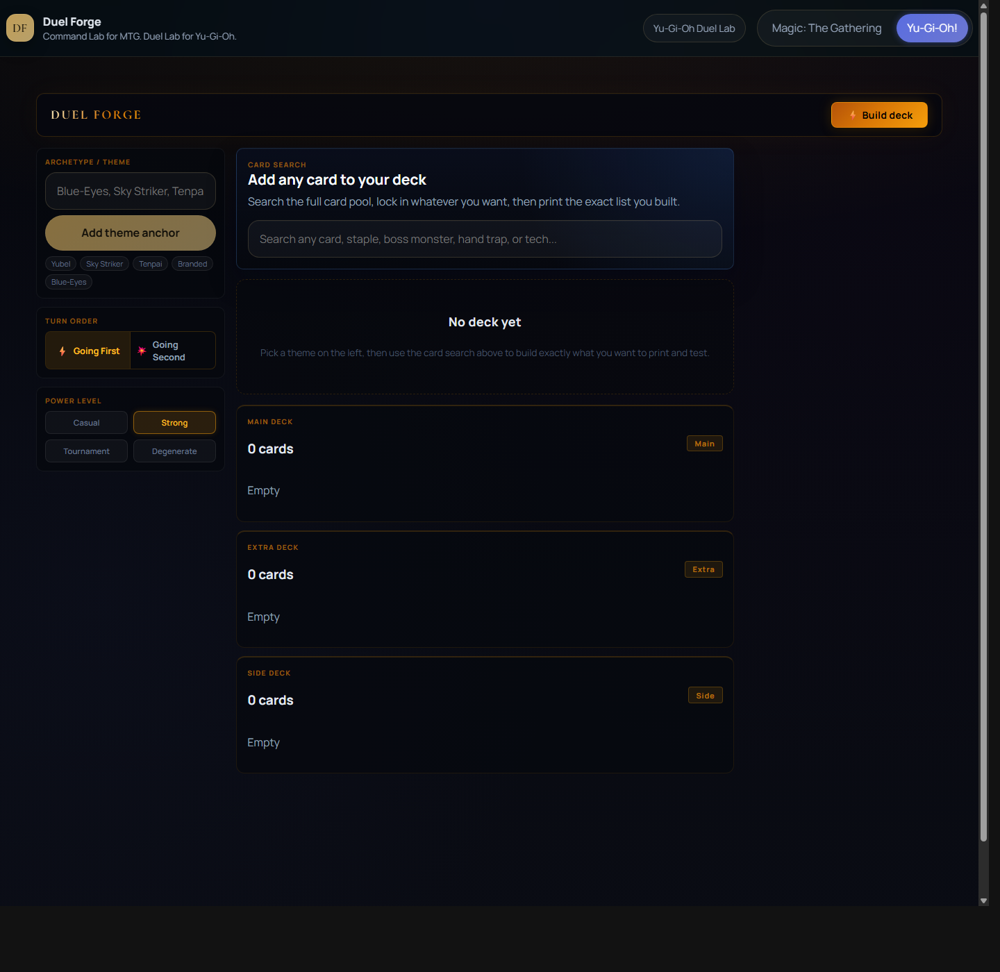

# Duel Forge

Dual-game deck building studio for:

- `MTG Command Lab`
- `Yu-Gi-Oh Duel Lab`

Live app: [duel-forge.vercel.app](https://duel-forge.vercel.app)

## What It Does

Duel Forge is built for players who want to generate strong lists fast, tune them manually, and print clean playtest proxies without leaving the site.

The project currently ships:

- a Commander-first Magic: The Gathering deck builder with meta-backed suggestions, power targeting, combo awareness, and print-ready proxy sheets
- a Yu-Gi-Oh builder focused on theme blending, anchored cards, popular deck-version biasing, manual seeding, and print-ready playtesting

The app is intentionally lightweight enough to deploy on Vercel while still pulling from strong free card and meta sources.

## Screenshots

### Launcher



### MTG Command Lab



### Yu-Gi-Oh Duel Lab



## Feature Highlights

### MTG Command Lab

- Commander-only deck building flow
- commander and color-identity discovery
- power-level targeting and deck-shape guidance
- EDHREC-backed recommendation context
- Commander Spellbook combo-pressure signals
- true-size printable proxy sheets for playtesting

### Yu-Gi-Oh Duel Lab

- archetype/theme-based deck generation
- multi-anchor blending instead of single-theme overwrite
- anchored card and anchored theme controls with active/inactive toggles
- deck generation from manually added seed cards, even without anchors
- popular deck-version targeting
- manual Main / Extra / Side editing and print flow
- `.ydk` export

## Data Sources

### MTG

- `Scryfall`
  Canonical card data, oracle text, legality, and card images
- `EDHREC`
  Commander popularity, recommendation buckets, and deck-shape context
- `Commander Spellbook`
  Combo-aware pressure and Commander-specific signals
- `Wizards of the Coast`
  Official Commander format source

### Yu-Gi-Oh

- `YGOPRODeck`
  Card search, archetype search, card images, and public deck/meta data

## Stack

- Next.js 16
- React 19
- TypeScript
- Zustand
- Zod
- Tailwind CSS 4

## Local Development

```bash
npm install
npm run dev
```

Useful checks:

```bash
npm run typecheck
npm run lint
npm run build
```

## Documentation

- [Architecture](docs/architecture.md)
- [Data Sources](docs/data-sources.md)
- [Deck Generation](docs/deck-generation.md)
- [Printing](docs/printing.md)
- [Meta Pipeline](docs/meta-pipeline.md)
- [Types and API Contracts](docs/types-and-api.md)
- [Scoring Model](docs/scoring-model.md)
- [Implementation Backlog](docs/implementation-backlog.md)
- [Phase 1 Shell Plan](docs/phase-1-shell-plan.md)
- [MVP Boundaries](docs/mvp-boundaries.md)
- [Acceptance Test Plan](docs/acceptance-test-plan.md)
- [UI Information Architecture](docs/ui-information-architecture.md)
- [Ingestion Operations](docs/ingestion-operations.md)
- [Risk Register](docs/risk-register.md)
- [Decision Log](docs/decision-log.md)
- [Yu-Gi-Oh Product Overview](docs/yugioh-overview.md)

## Notes

- Deck state persists locally in the browser.
- Proxy sheets are intended for personal playtesting and iteration workflows.
- The project is organized to stay employer-friendly on GitHub, with planning docs and architecture notes kept in `docs/`.

## License

MIT
